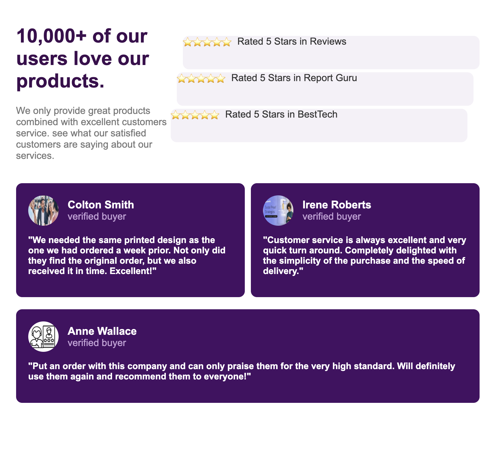
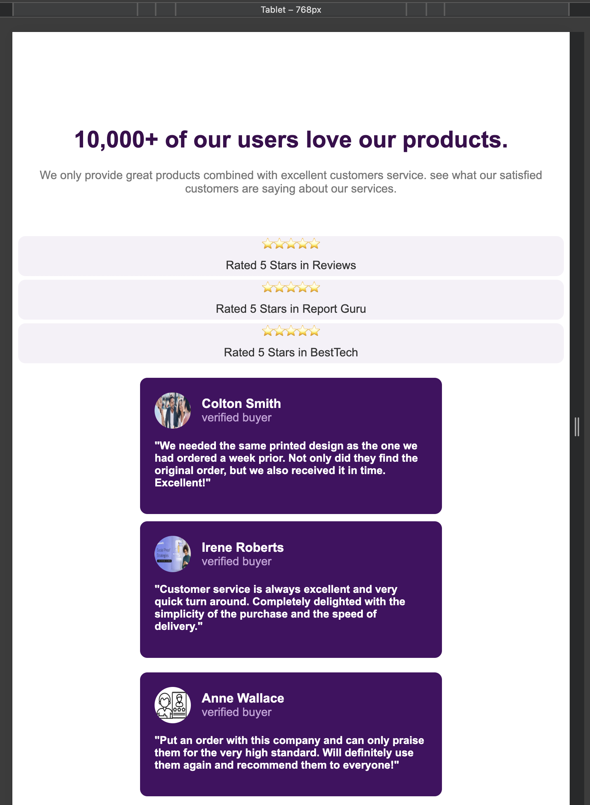
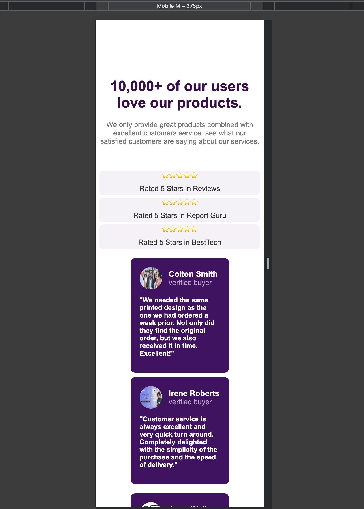

## Projet 2 : Social Proof (Exercice 3)
Mon deuxième projet en HTML et CSS. Ce projet met en avant les témoignages clients et les avis utilisateurs pour renforcer la crédibilité d’un produit ou d’un service. Il présente une interface moderne et réactive affichant :

Un titre accrocheur et une courte description de la satisfaction client.

Des évaluations sous forme d’étoiles provenant de différentes plateformes.

Des cartes de témoignages clients (photo, nom, statut, avis personnalisé).

L’objectif est de rassurer les visiteurs et d’augmenter la confiance dans le produit ou le service grâce à la preuve sociale.

Technologies utilisées : HTML & CSS

 Objectifs
Comprendre l’importance de la preuve sociale dans le design web.

Structurer une page HTML en sections logiques en utilisant la sémantique HTML5 appropriée.

Maîtriser les Media Queries pour assurer un design réactif (responsive).

Mettre en avant des témoignages clients de façon attractive grâce à la mise en page Flexbox ou Grid.

Travailler l’accessibilité (balises alt pertinentes, structure sémantique claire).

Développer ses compétences en intégration HTML & CSS.

Intégrer et styliser des icônes (ex: Font Awesome ou SVG) pour les évaluations et les avis.

## Captures d'ecran

## Lien
[Demo du projet Social Proof](https://asmah003.github.io/Social_Proof/)

## Expérience Personnelle
Pour mon deuxième projet HTML et CSS, j'ai eu une expérience personnelle très formatrice. Ce nouvel exercice m'a offert un entraînement crucial, me permettant de prendre la mesure exacte de mes progrès et de mes capacités.

J'ai pu constater une nette amélioration dans ma compréhension du Modèle de Boîte (Box Model) et de la mise en page Flexbox, résolvant des problèmes de centrage et d'espacement qui m'avaient bloqué auparavant.

Si ce projet a consolidé ma maîtrise de Flexbox, j'ai initialement rencontré des difficultés dans la détermination de la structure sémantique optimale pour une intégration propre. Bien que j'aie désormais une meilleure compréhension de ce concept essentiel, cela reste un point de vigilance. De même, la mise en place des Media Queries pour le design responsive a représenté un défi majeur. Je suis déterminé à approfondir cette maîtrise technique, notamment par la pratique intensive du CSS, pour garantir des mises en page réactives et fluides dans mes futurs projets.

Chaque ligne de code était une confirmation de mon apprentissage. C'est une expérience très positive.