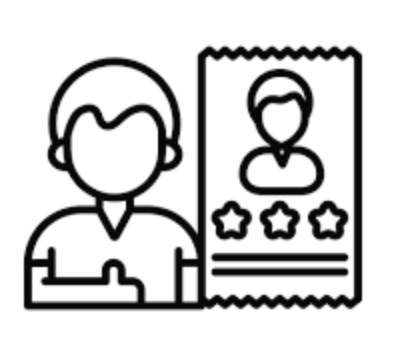

## Exercice3_P2:
Social Proof : Mon tout deuxieme  projet en HTML et CSS  
Ce projet met en avant les témoignages clients et les avis utilisateurs pour renforcer la crédibilité d’un produit ou d’un service. Il présente une interface moderne et responsive affichant :

Un titre accrocheur et une courte description de la satisfaction client.
Des évaluations sous forme d’étoiles provenant de différentes plateformes.
Des cartes de témoignages clients avec photo, nom, statut et avis personnalisé.
L’objectif est de rassurer les visiteurs et d’augmenter la confiance grâce à la preuve sociale.

Technologies utilisées : HTML & CSS

Objectifs

Comprendre l’importance de la preuve sociale dans le design web.

Structurer une page HTML en sections logiques (titre, avis, témoignages).

Utiliser le CSS pour créer une interface moderne et responsive.

Mettre en avant des témoignages clients de façon attractive.

Travailler l’accessibilité (balises alt, structure sémantique)

Développer ses compétences en intégration HTML & CSS.

Apprendre à utiliser les icons.

## captures d'ecran

## lien

[Demo]()

## Experience Personnel 
# Pour mon deuxième projet HTML et CSS, j'ai eu une expérience personnelle très formatrice. Ce nouvel exercice m'a offert un entraînement crucial, me permettant de prendre la mesure exacte de mes progrès et de mes capacités. J'ai pu constater une nette amélioration dans ma compréhension du Modèle de Boîte (Box Model) et de la mise en page Flexbox, résolvant des problèmes de centrage et d'espacement qui m'avaient bloqué auparavant. La nécessité de rendre le design réactif (mobile-friendly) m'a obligé à maîtriser les Media Queries, un bond en avant par rapport au premier projet statique. Finalement, cette deuxième tentative a non seulement renforcé mes bases techniques, mais a surtout boosté ma confiance dans ma progression en développement web. Chaque ligne de code était une confirmation de mon apprentissage. C'est une expérience très positive.